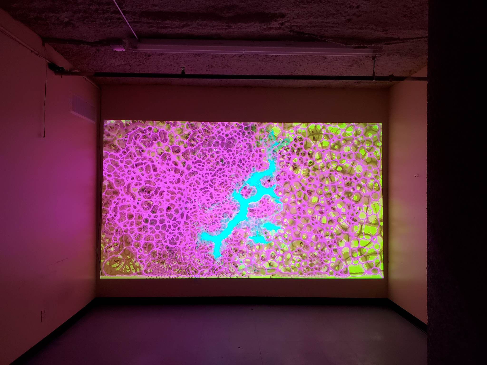

# Mysarum

Ongoing project featuring generally biologically inspired works, using Processing for experimentation, and Open Frameworks for final versions.

## Biomass

An installation focused 2D version of the project. Reactive to audio, video motion, and through a keyboard based controller.

## Inspiration

https://www.reddit.com/r/generative/comments/z6rzhc/physarum/
https://www.reddit.com/r/generative/comments/vf4511/figures_of_discomfort_is_a_generative_art_project/
https://www.youtube.com/watch?v=XSkaM-8Vgz8&t=1731s
https://www.reddit.com/r/AlienProject/top/?t=all
